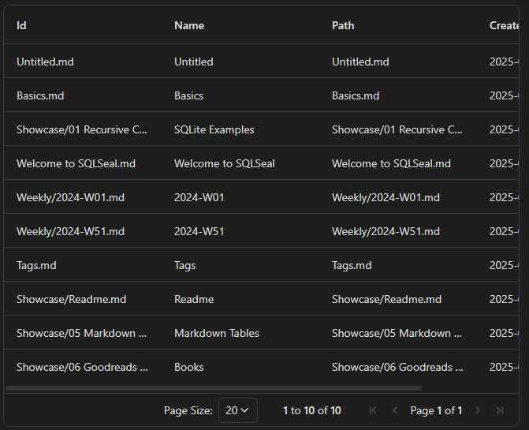
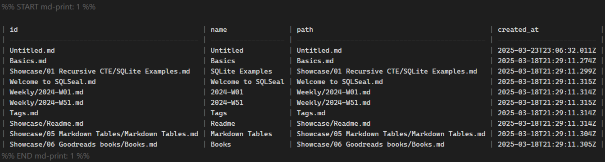

# SQLSeal Materializer

SQLSeal Materializer is an extension for SQLSeal Obsidian Plugin allowing to directly print (i.e., materialize) your already existing queries into your markdown files. This allows you to eternally keep your query results, even if SQLSeal or Obsidian gets discontinued.

## Features

- Printing the given query into your file (using the `MD-PRINT` renderer) while hiding the original query. Updates, either from changes in files or changes of the query in question, lead to a direct and live re-printing of the table.
- Replacing a given queries codeblock (using the `MD-REPLACE` renderer) by the printed table. This will make the original query a on-off.
- Both allow for:
  - Keeping your query results forever, even if SQLSeal or Obsidian get discontinued
  - Having links between your files, as those get saved in your files

However, please be **cautious** with this plugin, as it will directly alter your markdown files!

## Example Usage (using the [SQLSeal Demo Vault](https://github.com/h-sphere/sql-seal-demo-vault))

The following query would result in the following rendered grid table:

```sqlseal
GRID

SELECT id, name, path, created_at FROM files
ORDER BY modified_at DESC
LIMIT 10
```



By changing `GRID` to `MD-PRINT 1` (the `1` is the id of the codeblock and needed to successfully print the markdown table at the right location), the output looks like the following:

```sqlseal
MD-PRINT 1

SELECT id, name, path, created_at FROM files
ORDER BY modified_at DESC
LIMIT 10
```



